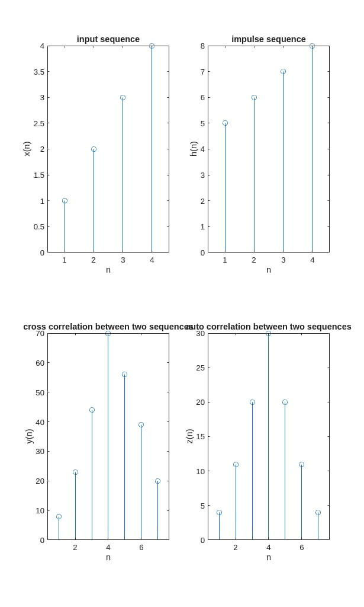

# auto-cross-correlation-matlab
This project uses MATLAB to compute auto and cross correlation of input signals and visualize them using plots

#  Auto & Cross Correlation of Signals using MATLAB

## Overview
This project implements **Auto Correlation** and **Cross Correlation** of discrete-time signals using MATLAB. It allows users to input sequences, compute correlations, and visualize the results using stem plots.

## Objectives
- Compute cross correlation between two signals  
- Compute auto correlation of a signal  
- Visualize signals and their correlation outputs  

##  Tools Used
- MATLAB  
- Built-in function: xcorr()

## Implementation
The program:
1. Accepts two input sequences:
   - Input signal → x(n)
   - Second signal → h(n)
2. Computes:
   - Cross Correlation → Xcorr(x, h)
   - Auto Correlation → xcorr(x, x) 
3. Displays results in a 2×2 subplot:
   - Input sequence  
   - Second sequence  
   - Cross correlation  
   - Auto correlation

  ## Output 
  

## How to Run in MATLAB

1. Open MATLAB software  
2. Create a new script file  
3. Save the file with .m extension  
   - Example: exp.m
4. Type or paste the MATLAB program into the script file  
5. Click on **Run** (or press F5) to execute the program  
6. Enter the input sequences in the Command Window when prompted  
7. Observe the output:
   - Input signals plotted  
   - Cross correlation result  
   - Auto correlation result  
8. The output graph will be displayed in the figure window and saved as an image file  

## ⚠️ Note
- Do not use reserved or confusing file names such as:
  - signal.m
  - auto.m
  - xcorr.m
- These names may conflict with built-in MATLAB functions and cause errors
